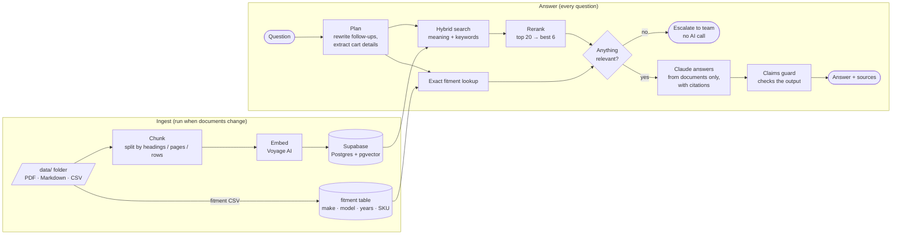

# Evolution Assistant

A question-answering assistant for a golf-cart windshield company. It answers **only from the
company's own documents**, cites its sources for every answer, and says "I don't know — here's
our team" instead of guessing.

> ⚠️ **This repo is public.** Real company documents live in `/data`, which is gitignored and
> blocked by a pre-commit check. The runnable demo uses `/sample-data`: a fictional brand,
> *Ridgeline Shields*, with invented products and prices.

**Status:** Phase 1 of 5 — core retrieval + a command-line tool. (Roadmap at the bottom.)

---

## How it works, in plain English

RAG stands for **retrieval-augmented generation**: before the AI writes an answer, we *retrieve*
the relevant passages from our own documents and give it only those to work from. It's the
difference between asking someone to answer from memory and handing them the manual open to the
right page.



### 1. Ingestion — preparing the documents
`npm run ingest` reads every file in the data folder and:

- **Tags it.** Its *audience* comes from the folder it's in (`public/` or `dealer/`). Its title,
  last-updated date and **approved-for-claims** flag come from `manifest.csv`. The defaults are
  the safe choice: not approved, and files outside those two folders are refused.
- **Chunks it** into passages of roughly 350 words, split along the document's own
  structure: headings in Markdown, pages in PDFs, rows in spreadsheets. A little text
  overlaps between neighbouring chunks so no idea gets cut in half.
  ([`lib/chunking.ts`](lib/chunking.ts))
- **Embeds each chunk.** An embedding converts text into 1,024 numbers that place it on a "map
  of meaning", where similar ideas sit close together even when they use different words.
  ([`lib/voyage.ts`](lib/voyage.ts))
- **Stores** the chunks and their embeddings in Postgres (Supabase), using the pgvector extension.
- **Fitment spreadsheets are different.** They go into a normal table with numeric year ranges,
  because "does it fit a 2019?" is an exact question and search engines can't do arithmetic.
  ([`lib/fitment.ts`](lib/fitment.ts))

### 2. Answering — every question
([`lib/answer.ts`](lib/answer.ts))

1. **Plan.** A quick Claude call rewrites follow-ups into standalone questions ("what about
   2018?" becomes "Does the clear windshield fit a 2018 Club Car Onward?") and pulls out the
   make, model, year and SKU. ([`lib/planner.ts`](lib/planner.ts))
2. **Hybrid search.** This combines *meaning* search (embeddings) with *keyword* search (for
   SKUs and model names) and merges the two ranked lists. **Dealer-only chunks are filtered
   out inside the database** unless the request comes from a verified dealer.
   ([`supabase/migrations/001_init.sql`](supabase/migrations/001_init.sql))
3. **Rerank.** A second model reads the question and each of the top 20 chunks side by side,
   scores how well each chunk answers it (0–1), and keeps the best 6.
4. **Fitment lookup.** An exact database query: make = X, model = Y, and the year falls inside
   the range. If no row matches, the assistant says so. It never guesses.
5. **Gate.** If nothing relevant was found, the question goes straight to "contact our team"
   without calling Claude at all. That's cheaper, and it leaves no chance to improvise.
6. **Generate.** Claude gets the chunks as *documents*, using Anthropic's citations feature.
   Every sentence in the answer comes back linked to the exact passage it was based on, and
   that quoted text is copied from our documents by the API, not written by the model.
7. **Check.** Code, not the model, verifies the result:
   - **The claims guard** ([`lib/claims.ts`](lib/claims.ts)) removes any safety, regulatory or
     performance sentence (DOT, UV, impact, "tested"…) that isn't backed by an
     approved-for-claims document, or whose numbers don't match that source.
   - **Uncited answers are not shown.**

### Why these safeguards are layered
The rules in the prompt ([`lib/prompt.ts`](lib/prompt.ts)) are the first line of defence, but
prompts are requests, not guarantees. Every rule that really matters is also enforced in code
that doesn't depend on the model's cooperation:

| Rule | Enforced by |
|---|---|
| Dealer info only for dealers | Database query filter (the model never sees dealer text) |
| **Dealer pricing is never stated — it's handled by email** | Planner flags pricing questions → fixed email reply before any search; prompt rule; output guard strips money sentences citing dealer docs ([`lib/pricing.ts`](lib/pricing.ts)); ingest warns when dealer docs contain prices |
| Don't guess fitment | Exact SQL lookup; "no rows" is passed along explicitly |
| Don't answer without sources | Relevance gate before the model; uncited answers blocked after |
| Claims only from approved docs | Claims guard checks citations + numbers |
| Never ingest outdated pages | `exclude` in the manifest + `INGEST_BLOCKLIST` |
| Real data never in git | `.gitignore` + pre-commit hook + GitHub Action |

## Tech choices

| Piece | Choice | Why |
|---|---|---|
| Generation | Claude (`claude-opus-5`) | Anthropic's recommended model; built-in citations |
| Embeddings | Voyage `voyage-4-large` | Anthropic's recommended embeddings provider; top retrieval quality |
| Reranking | Voyage `rerank-2.5` | Big accuracy gain for little cost |
| Database | Supabase Postgres + pgvector | Vectors, keyword search, auth and logs in one place |
| Language | TypeScript everywhere | One language from ingestion scripts to the web app |

## Setup

Requires Node 20.6+.

```bash
npm install                    # also installs the pre-commit safety hook
cp .env.example .env.local     # then fill in the keys (see comments in the file)
npm run db:migrate             # creates the tables and search function (needs DATABASE_URL)
                               #   …or paste supabase/migrations/*.sql into the Supabase SQL Editor and click Run
npm run ingest -- --sample     # load the fictional demo brand
npm run ask                    # chat mode; follow-up questions work
```

### Commands

| Command | What it does |
|---|---|
| `npm run ingest` | Sync `/data` into the database (only changed files are re-embedded) |
| `npm run ingest -- --sample` | Same, for the fictional `/sample-data` |
| `npm run ask -- "question"` | Answer one question and show the chunks, scores and cost |
| `npm run ask` | Chat mode with follow-ups |
| `npm run ask -- --dealer …` | Include dealer-only documents (local admin tool only) |
| `npm test` | Offline tests: chunking, fitment parsing, claims guard, loaders |
| `npm run check:private` | Scan every tracked file for private data or secrets |

## Adding real documents

1. Put files in `data/public/` or `data/dealer/`.
2. Add a row for each file to `data/manifest.csv`:
   `file,title,last_updated,approved_for_claims,exclude`
3. Run `npm run ingest`. Its warnings flag anything odd: a public file that mentions dealer
   pricing, a PDF that looks scanned, or a file missing from the manifest.

## Project layout

```
lib/          the pipeline (config, chunking, loaders, embeddings, search, planner, answer, claims guard)
scripts/      ingest · ask · migrate · check-staged (the privacy guard)
supabase/     database migrations
sample-data/  fictional Ridgeline Shields documents (safe to publish)
data/         real documents (gitignored, never committed)
test/         offline tests
```

## Roadmap

- [x] **Phase 1:** Core RAG. Ingestion + CLI with retrieved chunks and scores.
- [ ] **Phase 2:** Evaluation. ~25 questions with expected answers; pass/fail/made-up scorecard.
- [ ] **Phase 3:** Web chat UI in the brand's style; sources under each answer; Shopify-embeddable widget.
- [ ] **Phase 4:** Dealer magic-link login, lead capture, question logging.
- [ ] **Phase 5:** Vercel deploy with rate limits and a hard monthly spending cap.
- [ ] Later: sync fitment and the dealer list straight from Shopify.
